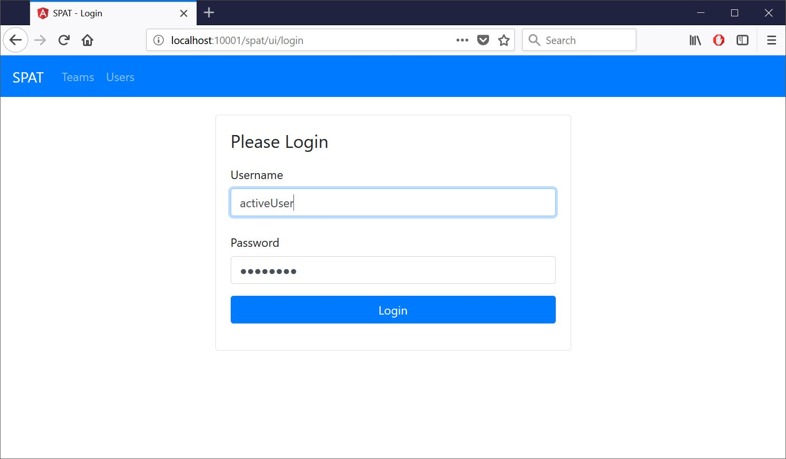
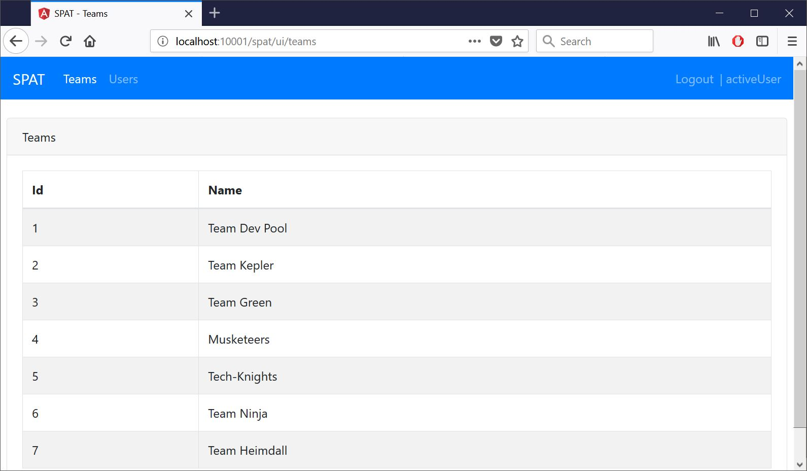
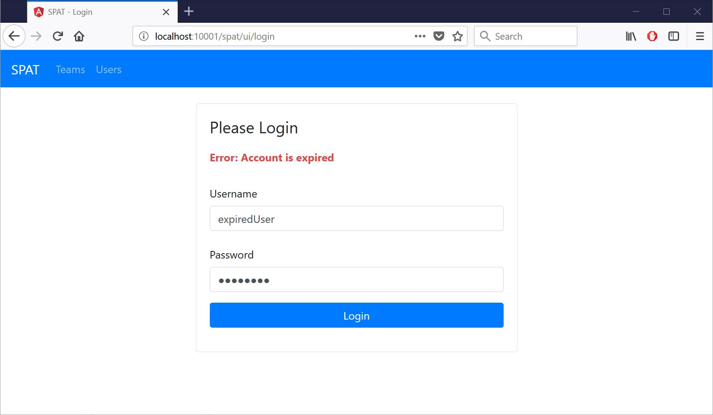
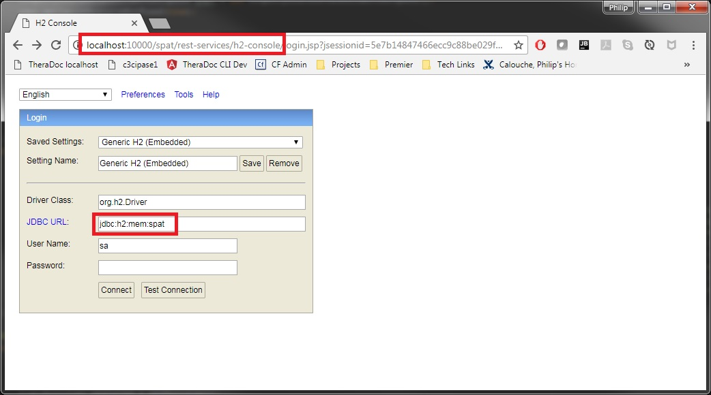
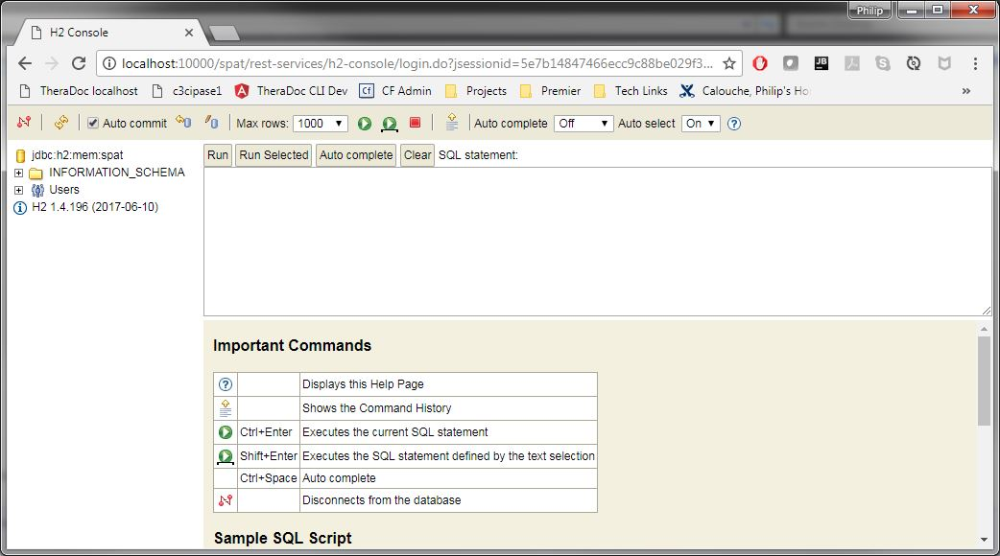
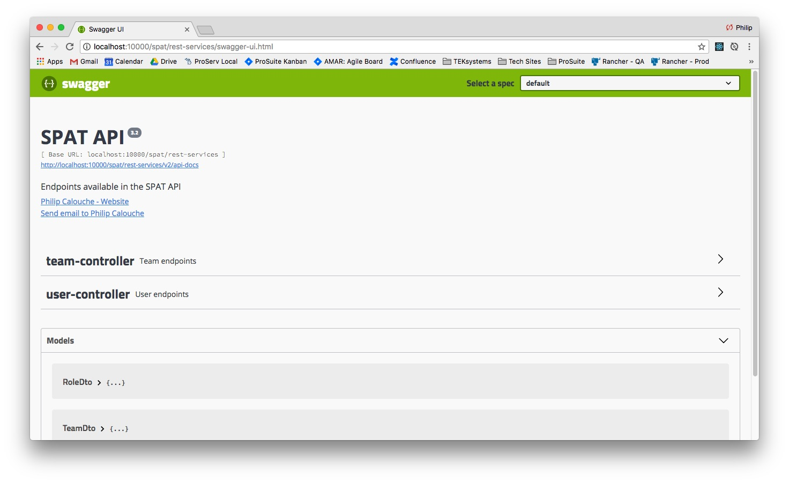

= Single Page App Template (SPAT)
Doc Writer <philip.calouche@outlook.com>
v4.0, 2019-02-09
ifdef::env-github[]
:tip-caption: :bulb:
:note-caption: :information_source:
:important-caption: :heavy_exclamation_mark:
:caution-caption: :fire:
:warning-caption: :warning:
endif::[]
:toc:
:source-highlighter: highlightjs
:icons: font

== Background
The purpose of this project was to demonstrate a REST service built on Spring Boot 2 that works with an Angular
6 single page app as well as a ReactJS single page app.  It consists of a login page, a teams page, and a users
page.  If logged in as the adminUser the teams and users pages will show controls for adding, editing, and
deleting teams and users respectively. This is to demonstrate permissions.  Backend security prevents adding,
editing, and deleting in the event a request is made to do either of those things as a non-admin user.

Some of my goals in this project were to:

. Create an organized and scalable project structure for a Spring Boot application and an Angular SPA or React JS SPA
. Have a clear developer workflow
. Have a clear build path to production
. Has web security consisting of a form login, JSON Web Token, and user roles
. Has front end code that warns user if their session is about to expire
. Back end unit testing with the ability to separate unit tests from longer running integration tests during the build process
. Demonstrates multiple types of HTTP requests (GET, POST, DELETE)
. Demonstrates multiple types of database operations (SELECT, UPDATE, DELETE)
. Automatic API documentation (SpringFox Swagger)
. Front end unit testing (Still a work in progress)

== Required Software
* Java 8 (latest JDK was used)
* Node.js (version 10.8.0 was used)

== Technologies and Frameworks
* Java 8 (latest JDK was used)
* Maven 3.6.0
* Spring Boot 2.1.2
* Spring Security making use of JSON Web Tokens (Learn more at https://jwt.io/[jwt.io])
* H2 in memory database (This can easily be swapped out for another datasource)
* Spring Data JPA
* SpringFox Swagger for API documentation
* JUnit 4 (I have plans to upgrade the tests to use JUnit 5)
* Angular 6/Angular CLI 6.2.1
* React/Create React App
* Bootstrap 4.2.1 for UI styling
* Font Awesome 5 for icons
* Node.js for Angular CLI and front end dependency management

== Project Structure
The project is a multi module Maven project.  It consists of three modules:

. *Rest Services* - A Spring Boot REST service
. *UI* - A Spring Boot web application for hosting the Angular and React SPAs

== How to Run
[IMPORTANT]
It is assumed that the required software is installed.

. From inside Spring Boot Project POM main directory:
+
  ./mvnw clean verify
+

This may take a few minutes on the first run, and the following will happen:
+
* The rest-services project will run all test and be built
* The angular-ui project will be built
* The react-ui project will be built
* The ui-services project will run all test and be built
. Run the REST services executable jar.  This runs at http://localhost:10000/spat/rest-services
+
  java -jar ./rest-services/target/rest-services.jar

. Run the UI executable jar
+
  java -jar ./ui-services/target/ui-services.jar
+
. Verify UIs are running at http://localhost:10001/spat/ui/angular and http://localhost:10001/spat/ui/react.  Verify login works.  Valid users are:
 .. activeUser/password
 .. activeAdmin/password (This user will have edit and delete capabilities)
+
.SPAT Login

.SPAT Teams Page

. Login can also be tested to show that invalid users don't work.  Invalid users are:
 .. expiredUser/password
 .. credentialsExpiredUser/password
 .. lockedUser/password
 .. disabledUser/password
+
.SPAT Bad Login

== IDE Setup Tips
If imported as a Maven project in an IDE the vast majority of the project setup should be done.  However, here are the run/debug configurations I setup:

. A run/debug configuration for com.pcalouche.spat.restservices.RestServices
. A run/debug configuration for com.pcalouche.spat.ui.Ui
. An npm start tasks for the Angular CLI project

During development I will run the REST services in debug mode and the npm start job for the Angular CLI project.  This updates both the REST services
and UI code on the fly when changes are made.

Periodically I will check that the UI is served correctly from the UI Spring application by doing an Maven build as mentioned in the *How to Run* section.

== H2 In Memory Database
The application uses the H2 in memory database.  On startup the database is always recreated by DatabaseLoader.java that implements Spring Boot's command
line interface.

There is a web console to the database that can be accessed by going to http://localhost:10000/spat/rest-services/h2-console and changing the
JDBC URL to *jdbc:h2:mem:spat*.

.H2 Console Login

.H2 Console Main Screen

== Swagger Documentation
Swagger documentation can be viewed when the rest-services application is running by going to http://localhost:10000/spat/rest-services/swagger-ui.html

.Swager UI

