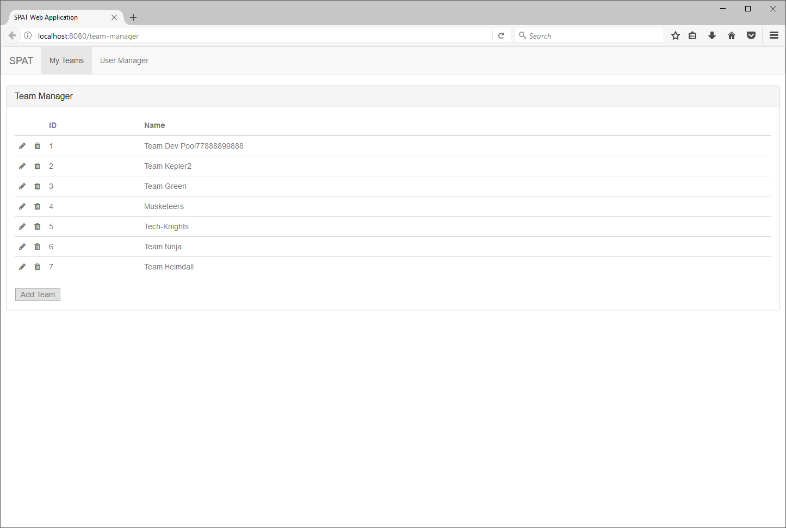
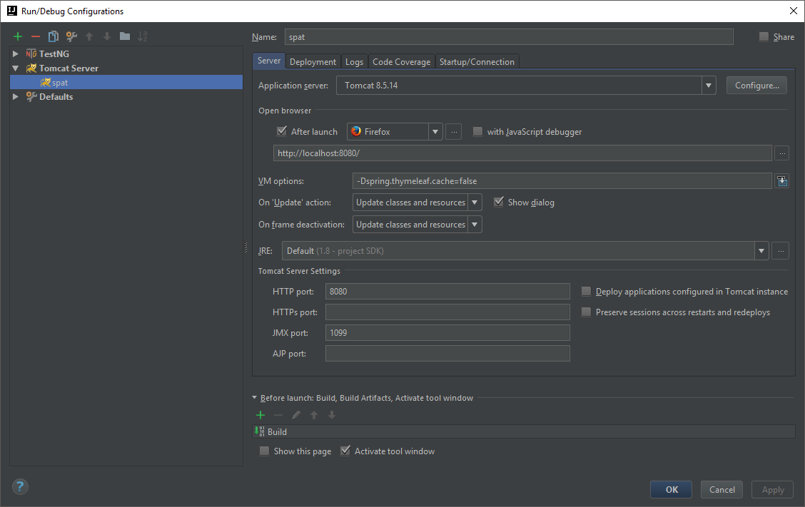

# Single Page App Template (SPAT)
## Background

I've had to build a few single page applications at my place of employment that made use of AngularJS, a REST service implemented in Spring, and a database connection.  I wanted to create a skeleton project that I can use for myself to get started quickly and for anyone else.  I also use this project to POC various things I'm interested in learning.  Below is what the SPAT web application looks like on startup:

## Technology Overview
### Frontend Technologies
1. **AngularJS** for the client side logic and single page app routing.  In the future I'd like to update this to Angular 4.
3. **Webpack** for building the front end code.
3. **Bootstrap** for my frontend widgets.  I have used the **AngularJS UI Bootstrap** library to remove the need for jQuery and the standard
jQuery that **Bootstrap** requires.

### Middleware Technologies
1. **Spring MVC** if the main middleware used to handle requests.  There are some stubbed out interceptors that can be expanded upon for logging
and authentication.
2. **SLF4J** and **Log4j** for logging.  There is a log42j.xml config in place that can be added to for additional logging and customization.

### Database Technologies
1. **PostgreSQL** I have included Maven dependencies and a basic spat.sql file for loading some simple test data for a PostgreSQL database.
Spring's JDBCTemplates were used for handling database queries. Obviously there are many ways to handle database interaction, so this just
serves as one way to show an end to end example.

##What this skeleton project provides
1. A structured REST service that can be expanded to suite your needs.
2. A structured AngularJS single page application that can also be expanded to suite your needs.
3. A SQL file for creating a simple test database.
4. Unit tests utilizing TestNG and Mockito that demonstrate how standalone and integrated tests against a database can be done.
5. Configuration to go from development mode to a production mode.

##Getting Started
1. You will need to following software installed:
   - [Java 8 JDK](http://www.oracle.com/technetwork/java/javase/downloads/jdk8-downloads-2133151.html)
   - [Maven 3](https://maven.apache.org/download.cgi)
   - [PostgreSQL](https://www.postgresql.org/download/)
   - [Node.js](https://nodejs.org/en/)
   - [Tomcat 8](https://tomcat.apache.org/download-80.cgi)
2. Create a database in PostgreSQL.  Use the spat.sql file to populate that database.  Create a test database and run the spat.sql against that for the unit tests.  Refer to database.properties and database-test.properties to see what the connection info is.  These property files can be updated to suite your needs.
3. Install webpack globally: `npm install -g webpack`

## Development Mode
1. In your preferred IDE import this project as a Maven project.  The details of importing a Maven project vary between IDES and is thus beyond the scope of the README.
2. Create a Tomcat run configuration and set `spring.thymeleaf.cache` to false, so ThymeLeaf Templates are not cached.  See `SpatMvcConfig.java` for how ThymeLeaf template caching gets configured by this environment variable.  This avoids having to restart your server to see a change in a Thymeleaf template.  The image belows represents that this can look like in IntelliJ.

## Production Mode
1. Run `mvn install` from the command line.  This will perform the following in the listed order:
   - Through the Maven exec plugin run npm install (`npm install`).
   - Through the Maven exec plugin run webpack to create the optimized front in assets that will be served from the webapp/resources/dist folder (`webpack run build:prod`).
   - Compile all Java classes and run unit tests.
   - If all unit test pass then a spat.war file will be created.  This can be deployed to a Tomcat server.
