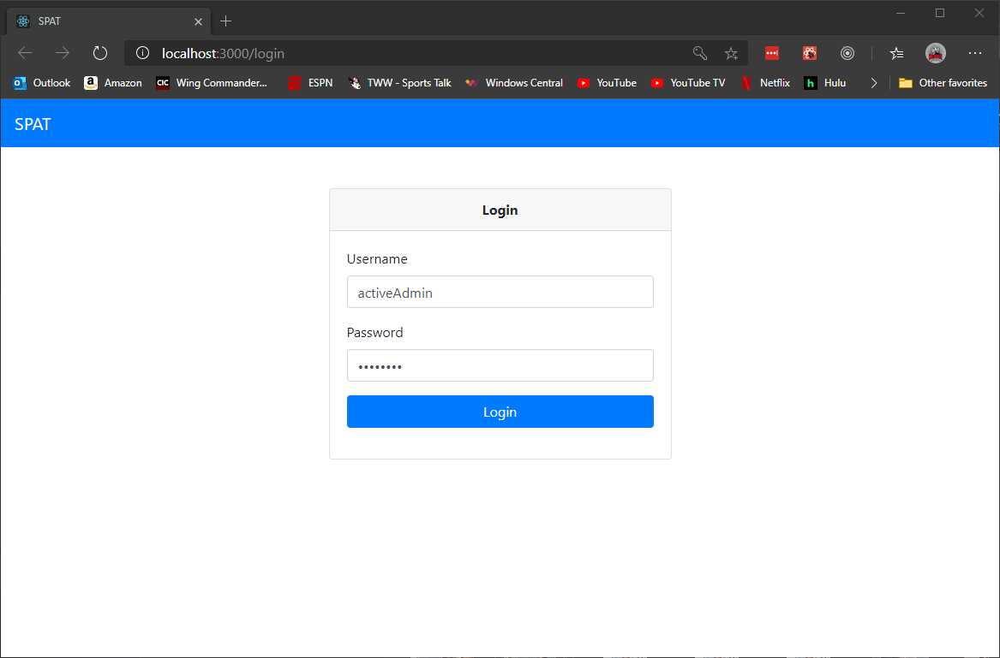
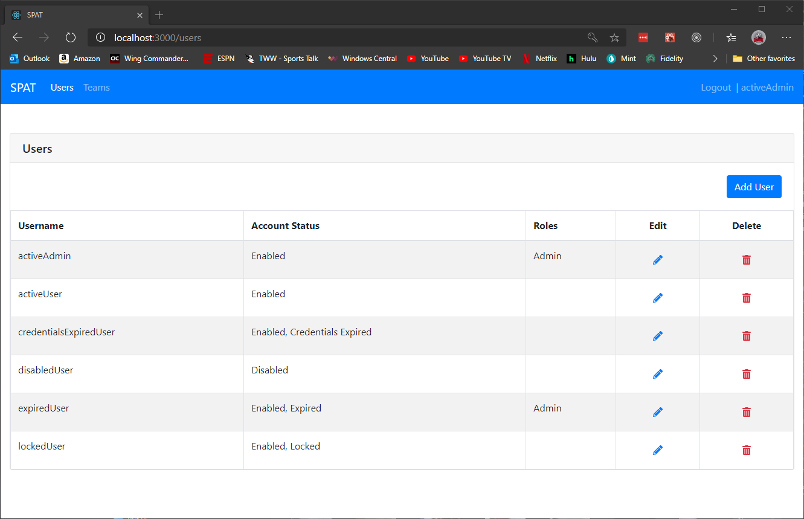
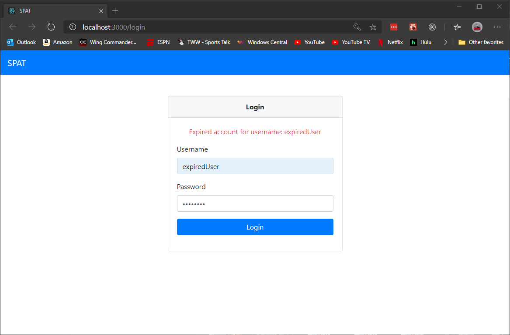
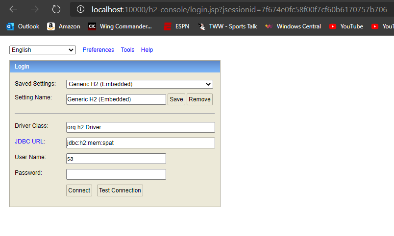
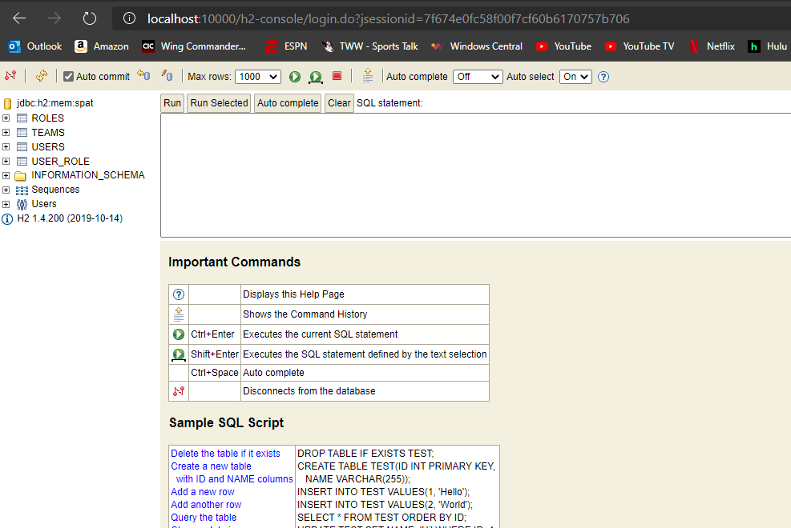
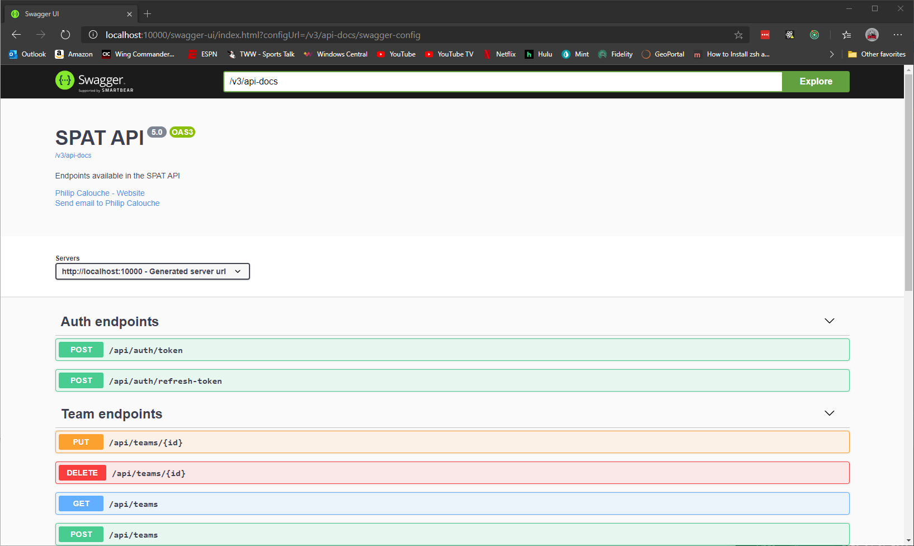

# Single Page Application Template (SPAT)

## Table of Contents
[Background](#background) 
[Required Software](#required-software) 
[Technologies, Languages, and Frameworks](#technologies-languages-and-frameworks) 
[Project Structure](#project-structure) 
[How to Run](#how-to-run) 
[H2 In Memory Database](#h2-in-memory-database) 

## Background
I've changed the structure of this application around a few times now, but the goals of it have pretty much 
stayed the same. 

The purpose of this project was to build a single page application built using Spring Boot and ReactJS SPA that 
has authentication and authorization through JWTs. It consists of a login page, a users page, and a teams page.
If logged in as **adminUser** the teams and users pages will show controls for adding, editing, and deleting users 
and teams respectively. If logged in as **activeUser** this controls won't be present.  This is to demonstrate 
permissions. Backend security prevents adding, editing, and deleting by a non-admin user.

Some of my goals in this project were to:

* Create an organized and scalable project structure for a Spring Boot application and React SPA
* Web security consisting of a form login, JSON Web Token, and user roles
* Session management and expiration. The use receives a warning their session is about to expire
* Through backend unit testing
* Provide Swagger API documentation
* Demonstrate a path to production

## Required Software

* Java 8
* Node.js

## Technologies, Languages, and Frameworks

### Backend
* Java 8 (on my list to upgrade to Java 11)
* Maven 3.6.3
* Spring Boot 2
* Spring Security that utilizes JSON Web Tokens
* Spring Data JPA. Hibernate does the data creation in this implementation, but custom scripts
 or Liquibase is also an option.
* H2 in memory database. This can easily be swapped out for another database.
* SpringDoc Open API for Swagger API documentation (https://github.com/springdoc/springdoc-openapi)
* JUnit 5

### Front End
* React using Create React App (https://reactjs.org/docs/create-a-new-react-app.html)
* Reactstrap for Bootstrap 4 React Components (https://reactstrap.github.io/)
* React Font Awesome for icons (https://github.com/danawoodman/react-fontawesome)
* Formik for forms with ReactJS (https://jaredpalmer.com/formik/)

## Project Structure

The project is a multi module Maven project consisting of two modules:

* **spat-react-client** - A React JS application using Create React App
* **spat-services** - Spring Boot REST service project

## How to Run
Each project can be imported into your preferred IDE. The steps below are how to
run and build from the command line.

### spat-react-client
1. Navigate to spat-react-client folder in console
1. Do `npm install`
1. Do `npm run start`

This will open a browser window at http://localhost:3000.

### spat-services
1. Navigate to spat-services folder in console
1. Run `mvnw spring-boot:run`. The will install dependencies and run the application.

At this point the service is running on http://localhost:10000

With spat-react-client and spat-services now running you should be able to login as
`activeAdmin/password` or `activeUser/password`.

Attempting to login as any of the following will fail with a reason given:
* **credentialsExpiredUser**
* **disabledExpiredUser**
* **expiredExpiredUser**
* **lockedUser**

These users can be updated inside the application.

### Building for Production
1. Navigate to spat-react-client folder in console
1. Do `npm run build`
1. Transfer the assets in spat-react-client/build to your hosting solution
1. Navigate to `spat-services` folder in console
1. Run `mvnw clean package` to run test and create a jar file
1. This will create a `target` folder that contains a `spat-services.jar`.
1. Run `java -jar target/spat-service.jar` to run the jar file. You can choose to run the jar in Docker if you wish.

## H2 In Memory Database

The application uses the H2 in memory database. On startup, DatabaseLoad.java always re-creates the database.

There is a web console to the database that can be accessed by going to http://localhost:10000/h2-console and 
changing the JDBC URL to *jdbc:h2:mem:spat*.

## Swagger Documentation

Swagger documentation can be viewed when the spat-services application is running by going to http://localhost:10000/swagger-ui.html.

